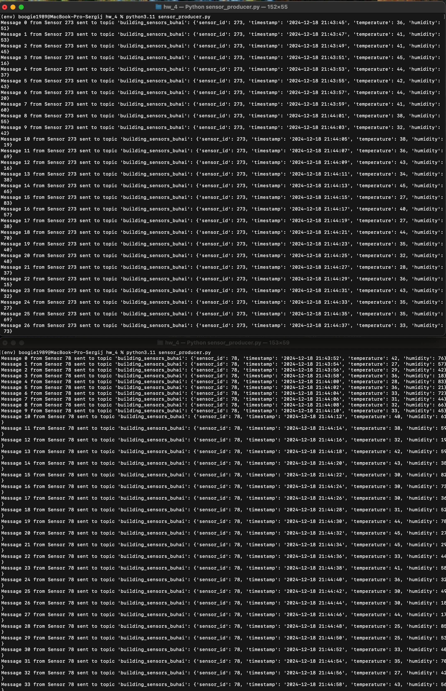
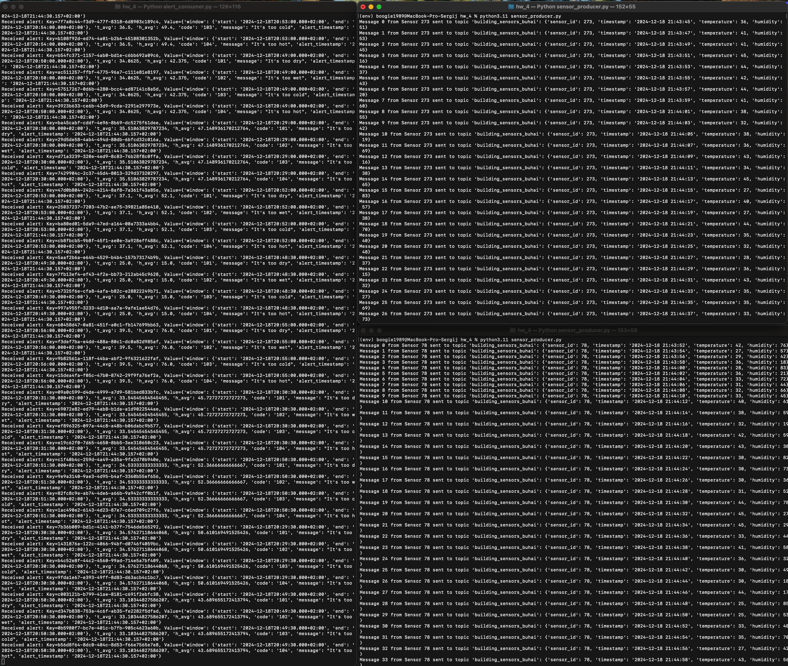

# Домашнє Завдання: Spark Streaming з Apache Kafka

## Опис Завдання

У цьому домашньому завданні було реалізовано систему моніторингу даних ІоТ сенсорів за допомогою **Apache Kafka** та **Apache Spark Streaming**. Система складається з наступних компонентів:

1. **Продюсер Сенсорних Даних (`sensor_producer.py`)**: Скрипт, який генерує випадкові дані сенсорів (температура, вологість) та відправляє їх до Kafka-топіку `building_sensors_buhai`.

2. **Spark Streaming (`spark_streaming.py`)**: Програма, яка зчитує дані з Kafka, агрегує їх за допомогою Sliding Window, обчислює середні значення температури та вологості, перевіряє умови алертів з файлу `alerts_conditions.csv`, та відправляє алерти до Kafka-топіку `avg_alerts_buhai`.

3. **Консюмер Алертів (`alert_consumer.py`)**: Скрипт, який зчитує алерти з Kafka-топіку та демонструє їх у консолі.

## Структура Проекту

```
goit-de-hw-06/
├── data/
│   └── alerts_conditions.csv
├── configs.py
├── sensor_producer.py
├── spark_streaming.py
├── alert_consumer.py
├── requirements.txt
└── README.md
```

## Встановлення та Налаштування

1. **Створення та Активація Віртуального Середовища**

   ```bash
   python3 -m venv env
   source env/bin/activate
   ```

2. **Встановлення Залежностей**

   ```bash
   pip install -r requirements.txt
   ```

3. **Запуск Компонентів**

   - **Запуск Продюсерів Сенсорних Даних**

     Відкрийте **два** окремі вікна Terminal, перейдіть до каталогу проекту та запустіть продюсери:

     ```bash
     cd /path/to/goit-de-hw-06/
     source env/bin/activate
     python sensor_producer.py --num_sensors 2 --interval 2
     ```

   - **Запуск Spark Streaming**

     Відкрийте **третє** вікно Terminal, перейдіть до каталогу проекту та запустіть Spark Streaming:

     ```bash
     cd /path/to/goit-de-hw-06/
     source env/bin/activate
     python spark_streaming.py
     ```

   - **Запуск Консюмеру Алертів**

     Відкрийте **четверте** вікно Terminal, перейдіть до каталогу проекту та запустіть консюмер алертів:

     ```bash
     cd /path/to/goit-de-hw-06/
     source env/bin/activate
     python alert_consumer.py
     ```

## Опис Скріншотів

1. **Скріншот Генерації Даних Сенсорів**

   На першому скріншоті показано два одночасні запуски програми `sensor_producer.py`, які генерують та відправляють дані до Kafka-топіку `building_sensors_buhai`.

   

2. **Скріншот Відправки Алертів у Топіки**

   На другому скріншоті демонструється, що відфільтровані алерти були успішно відправлені до Kafka-топіку `avg_alerts_buhai` та відображені у консюмері алертів.

   

## Перелік Файлів

- **`configs.py`**: Конфігураційні налаштування для підключення до Kafka.
- **`sensor_producer.py`**: Скрипт для генерації та відправки сенсорних даних до Kafka.
- **`spark_streaming.py`**: Скрипт для обробки потокових даних та генерації алертів.
- **`alert_consumer.py`**: Скрипт для споживання та відображення алертів з Kafka.
- **`alerts_conditions.csv`**: Файл з умовами для генерації алертів.
- **`requirements.txt`**: Список необхідних Python-пакетів.
- **`README.md`**: Цей файл з описом проекту та інструкціями.

## Додаткові Налаштування

- **Конфігурація Kafka**: У файлі `configs.py` налаштуйте параметри підключення до вашого Kafka-кластера.
- **Умови Алертів**: У файлі `alerts_conditions.csv` можна змінювати критерії генерації алертів відповідно до потреб.

## Виконання Завдання

1. **Запуск Продюсерів Сенсорних Даних**: Запустіть два екземпляри `sensor_producer.py` у окремих терміналах, щоб одночасно генерувати дані сенсорів.

2. **Обробка Даних за Допомогою Spark Streaming**: Запустіть `spark_streaming.py`, який буде агрегувати дані, аналізувати їх та генерувати алерти.

3. **Споживання Алертів**: Запустіть `alert_consumer.py`, щоб бачити відправлені алерти у реальному часі.

4. **Перевірка Результатів**: Переконайтеся, що алерти з'являються у консюмері та відповідають заданим умовам у `alerts_conditions.csv`.

## Заключні Кроки

1. **Перевірте, що всі компоненти працюють стабільно**.
2. **Зробіть необхідні скріншоти**:
   - **Генерація та відправка даних сенсорів** з двома одночасними запусками програми.
   - **Відправка алертів у відповідні топіки**.
3. **Оформіть домашнє завдання**:
   - Створіть текстовий документ з описом виконаного завдання та вставте скріншоти у відповідні місця.
   - Завантажте весь проект у публічний репозиторій `goit-de-hw-06`.
   - Створіть архів із назвою `ДЗ6_ПІБ.zip`, який містить весь код та документ зі скріншотами, і прикріпіть його до LMS.
   - Надішліть посилання на репозиторій для перевірки.

## Додаткові Рекомендації

- **Переконайтеся, що всі скріншоти чіткі та зрозумілі**.
- **Описуйте кожен скріншот коротким коментарем**, щоб ментор міг легко зрозуміти, що саме він бачить.
- **Перевірте роботу системи** перед створенням скріншотів, щоб уникнути помилок у виконанні завдання.

---
**Успіхів у виконанні домашнього завдання!** Якщо виникнуть додаткові питання або потрібна допомога, звертайтеся до ментора.
```